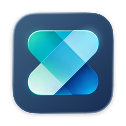
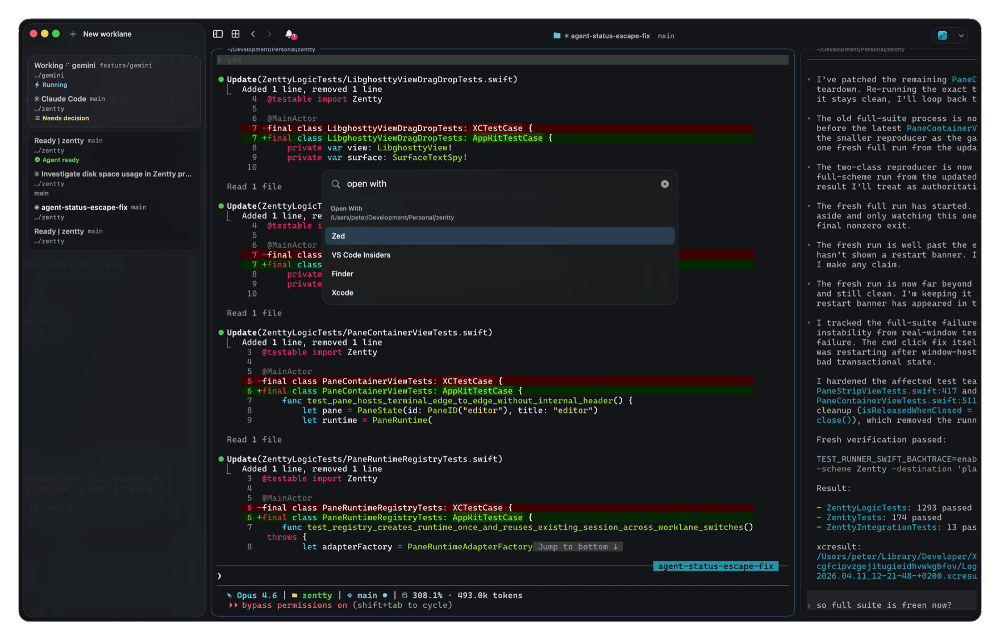

<!-- LOGO -->
<h1>
<p align="center">
  
  <br>Zentty
</h1>
  <p align="center">
    A native macOS terminal for agent-native development, built on Ghostty.
    <br />
    Zentty gets out of the way. Minimal friction, maximum focus.
    <br />
    <a href="https://github.com/dedene/zentty/releases/latest/download/Zentty.dmg">Download</a>
    ·
    <a href="#install">Install</a>
    ·
    <a href="#status">Status</a>
    ·
    <a href="#build">Build</a>
    ·
    <a href="CONTRIBUTING.md">Contributing</a>
  </p>
</p>

<p align="center">
  
</p>

## Features

- **Worklanes, not just tabs.** Borrowed from niri and Hyprland: a horizontally-scrolling strip of columns, each column a vertical stack of panes. Rearrange, resize, and navigate without losing your place.
- **Keyboard-first, top to bottom.** Every action is a command. Every command is bindable. Rebind anything in settings, or fall back to the command palette when your muscle memory runs out.
- **Resume your workspace** Zentty restores your worklanes on relaunch and can reopen agent sessions that were closed without finishing.
- **Command palette** A fuzzy-searchable list of every action in the app, with your recent commands on top.
- **Global search** Search inside the current pane or across every worklane with a single shortcut. Search without losing flow.
- **Agent-aware.** Claude Code, Codex, Copilot CLI, Gemini CLI, and OpenCode report their status into the sidebar, so you see what they're doing, what they're asking, and when they need you, without switching panes.
- **Native Ghostty themes.** Zentty reads Ghostty themes directly, with a built-in picker, live preview, opacity, and blur.
- **Scriptable control** Interaction with worklanes or panes is scriptable via the embedded zentty CLI.
- **Built on Ghostty.** GPU-accelerated rendering via `libghostty`, wrapped in a native Swift and AppKit shell. No Electron, no web views. It feels like a Mac app because it is one.

## Install

Download the latest `.dmg` from the [releases page](https://github.com/dedene/zentty/releases/latest), open it, and drag Zentty to your Applications folder.

Zentty updates itself in place via [Sparkle](https://sparkle-project.org) once installed. No need to check back here for new versions.

Builds are signed and notarized by Zenjoy BV. Requires macOS 26 (Tahoe) or later.

## Status

Zentty is in active development. Expect rapid iteration, rough edges, and occasional breaking changes while the project is opened up.

## Requirements

- macOS 26 (Tahoe) or later
- Xcode
- `zig` on `PATH`
- `gettext` on `PATH`

## Build

Zentty requires a local `GhosttyKit.xcframework` before the app can build normally.

Build the framework:

```bash
./scripts/build_ghosttykit.sh
```

Then build the app:

```bash
xcodebuild -project Zentty.xcodeproj -scheme Zentty -destination 'platform=macOS' build
```

If you need to regenerate the Xcode project from [`project.yml`](project.yml):

```bash
bundle exec fastlane mac generate_project
```

More detail about the Ghostty bootstrap flow lives in [`docs/ghosttykit-setup.md`](docs/ghosttykit-setup.md).

## Test

Run the full test suite:

```bash
xcodebuild test -scheme Zentty -destination 'platform=macOS'
```

## Agent Hooks

Zentty bundles helper commands and environment variables for agent-aware workflows inside terminal panes.

Hook configuration details are documented in [`docs/agent-hooks.md`](docs/agent-hooks.md).

## Contributing

Contributions are welcome. Start with [`CONTRIBUTING.md`](CONTRIBUTING.md).

Before a non-trivial contribution can be merged, contributors must agree to [`CLA.md`](CLA.md).

## License

Zentty is available under the GNU General Public License v3.0 only (`GPL-3.0-only`). See [`LICENSE`](LICENSE).

If your organization cannot or does not want to comply with GPLv3, alternative commercial licensing may be available from Zenjoy BV. Contact `hallo@zenjoy.be`.

## Trademarks

The GPL license covers the code. It does not grant rights to use the Zentty name, logos, icons, or other branding for your own distribution.

See [`TRADEMARKS.md`](TRADEMARKS.md) for branding rules.
